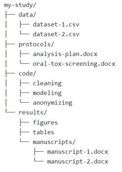

# Guidance on File Organization

### Consistently organize your files and folders

The most important guidance is to keep study file/folder naming and organization internally consistent within your study.  

* Establish naming and organization conventions for your study files and folders at the start of your study and consistently apply them throughout.

### Organize study-related files and folders into a single study folder

Organize all [study files/resources](../terms/index.md#study-filesresources) into a single study folder/directory. A study folder/directory may of course have sub-directories. See below for an example of a recommended study folder/directory structure.

### Organize study-related files into folders with consistent naming conventions

* Organize all your files (whether you will share them or not), into folders.
* In general, **minimize the number of folders** at each level, and the number of 'layers' of your whole directory.
  * File naming conventions can often be used quite effectively to 'organize' files and to provide clues as to what the files are and how they relate to each other without resorting to using separation into different directories to serve that purpose.
* However, there is a limit to naming conventions, and you may want to separate your files into directories based on some type of logical groupings. See below for further details.

    

!!! note "Reminder"
    Before creating more directories or directory layers, consider whether file-naming conventions may be used more efficiently to create this organization.

### Create logical groupings

There are a number of ways to group files logically. Below are some examples of how you can logically group your files in folder structures:

| Grouping strategy      | Examples                                                  |
| :---------             | :---------------------------------------------------------|
| By file category       | Raw data grouped together; processed data grouped together;  protocols grouped together; data dictionaries grouped together|
| By experimental subject| All data from a particular experimental subjects (across all protocols grouped together, etc.) |
| By type of experiment  | All (electrophysiology) current clamp experiment files grouped together; all (electrophysiology) voltage clamp experiment files grouped together |
| By experiment          | All data from a particular protocol, across all experimental subjects to which the protocol applies, grouped together |
| By file type           | All neuroimaging FMRI files grouped together |

