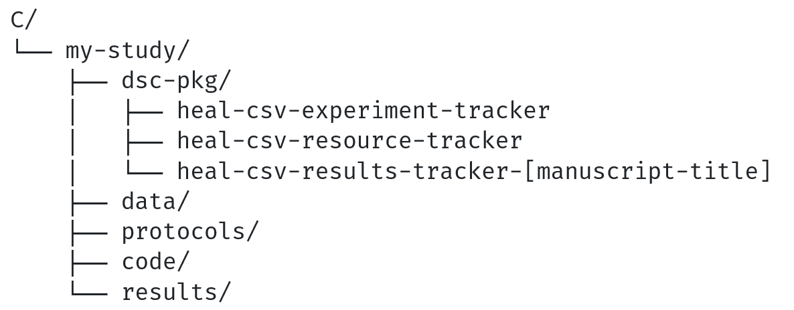

#### Set yourself up for success

In previous steps, you transformed your centralized study folder into a local [data package](../terms/index.md#data-package) by adding [Standard Data Package Metadata](../terms/index.md#standard-data-package-metadata-files). In the instructions that follow, this folder will be referred to as either your "local data package" or "my-study" folder.

Before you begin, you should review a few things to ensure you are ready to prepare your data package for submission. 

* Review the contents of your local data package or "my-study" folder. Ensure that all study files and standard data package metadata stored in your dsc-pkg folder (i.e., Resource Tracker, Results Tracker(s), Experiment Tracker, Data Dictionary(ies)) are saved within your centralized study folder. Your study folder may look something like this:

  

* Review your Resource Tracker and Results Tracker(s) to ensure that you have annotated all resources that you are planning to share in a repository. Also confirm that:
  * All "access" and "access-date" fields are filled out completely and in accordance with your plan on how and when to share each resource. Accuracy of these fields will be essential for creating your shareable data package. See the [Resource Tracker schema](../../schemas/md_resource_tracker/) for more information about how to fill out these fields.
  * In addition to all relevant study files/resources, your Results Tracker(s) and Data Dictionary(ies) have been added to your Resource Tracker as resource(s).

* If your my-study folder looks complete and all resources have been annotated, then you are ready to move to creating shareable data package(s).

* Create another folder at the same level as your my-study folder. This folder will hold all shareable data package(s) you create, plus the accessory files that you will submit alongside your shareable data package(s) (i.e., an overview Resource Tracker and a README). In the instructions that follow, this folder will be referred to as your "my-study-share" folder.

  
